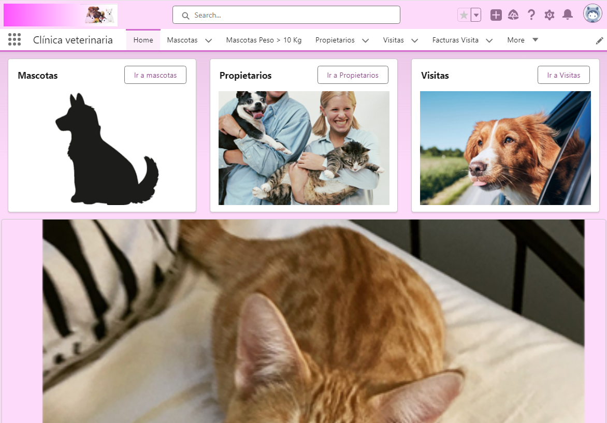
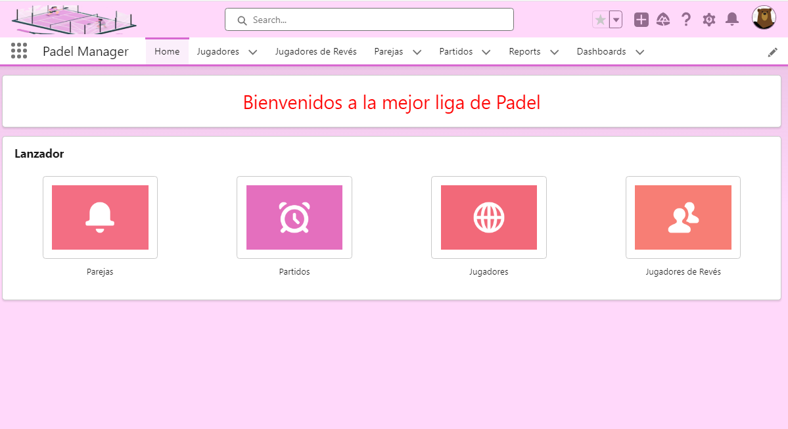
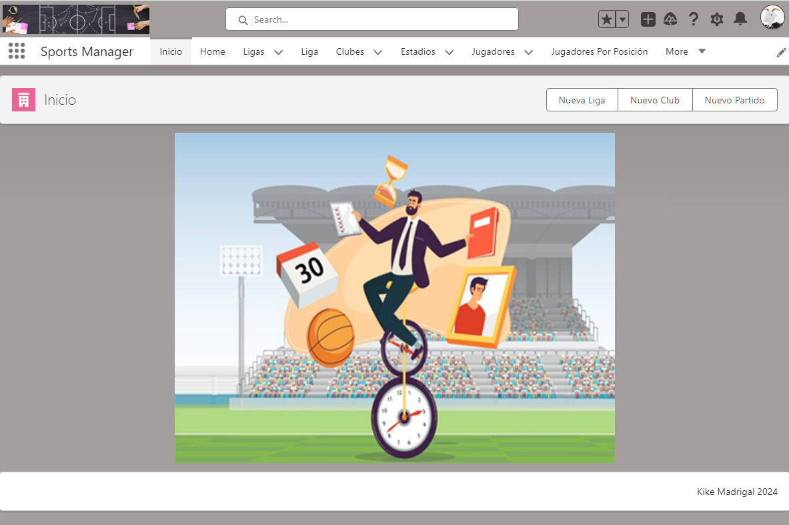
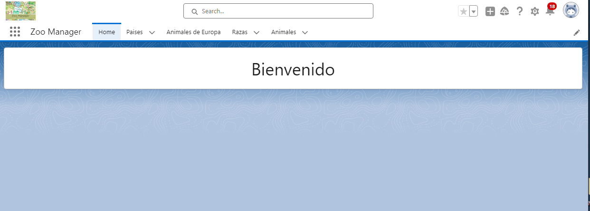

# Proyectos para practicar salesforce

## Que es salesforce

<a href="https://www.salesforce.com/es/" target="_blanck">Salesforce </a>es una plataforma en la nube que te permite crear aplicaciones orientadas a los clientes (un rollo de marketing, leads, oportunidades, enviarle ofertas, ir sacando informes para ver como va la cosa, etc), en realidad es un programa normal en la nube que te permite llevar tu empresa y vender cosas online.

Puedes aprender sobre safelsforce en esta web: <a href="https://trailhead.salesforce.com/es">trailhead</a>

## Los proyectos

1. Clinica veterinaria

<a href="https://github.com/kikemadrigal/Salesforce-projects/blob/main/ClinicaVeterinaria/README.md">Más información</a> 

2. Padel Manager

<a href="https://github.com/kikemadrigal/Salesforce-projects/blob/main/PadelManager/README.md">Más información</a> 

3. SportManager
   

<a href="https://github.com/kikemadrigal/Salesforce-projects/blob/main/SportManager/readme.md">Más información</a> 

4. Zoomanager

<a href="https://github.com/kikemadrigal/Salesforce-projects/blob/main/Zoomanager/README.md">Más información</a> 

En este artículo se describe el proceso completo del copiado de un playground o sandbox a otro: https://sf.tipolisto.es/copia-tu-playground/

1. Cree su playground o sandbox y obtengo su usuario, su contrasña y la URL

2. Clone o descargue el proyecto que desee:

   2.1 Clinica veterinaria

   2.2 Sport Manager

   2.3 Padel Manager
   
   2.4 Zoo Manager

3. Estudie el esquema de la base de datos para ir deployeando los objetos con sus relacciones en el orden correcto.

4. Importe los datos según el esquema.

5. Asigne los permission sets correpondientes.

